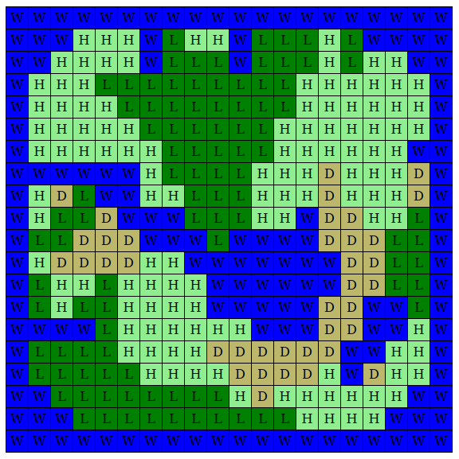
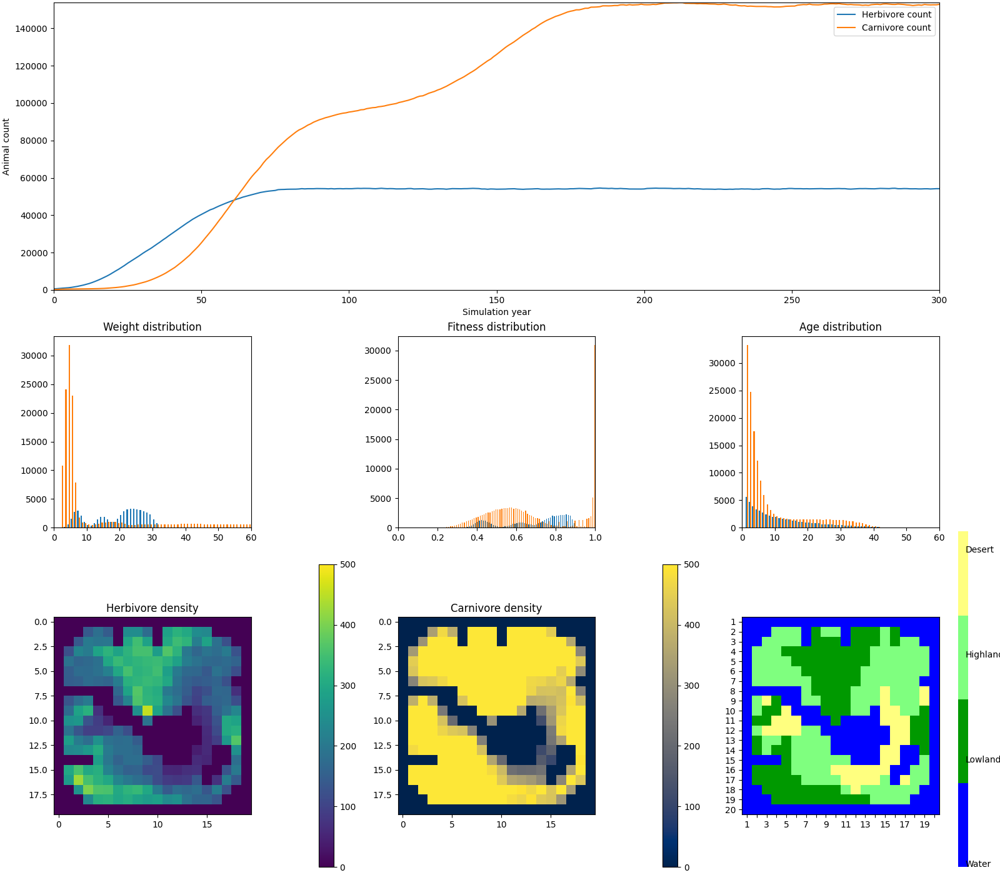

# ***BioSim***
### This is a program to simulate a world having 2 species of animals
<ol>
<li>Carnivore</li>
<li>Herbivore</li>
</ol>

### The World :

The world is made of cells, each cell can be thought of as a unit area in the world, cell can be of four types W,H,L and D, they stand for
<ul>
    <li>W : Water</li>
    <li>H : High Land</li>
    <li>L : Low Land</li>
    <li>D : Desert</li>
</li>

#### Sample World

In the program we create a map using the string representation, as shown below:
> 
> <code> world = """\
                WWWWWWWWWWWWWWWWWWWW
                WWWHHHWLHHWLLLHLWWWW
                WWHHHHWLLLWLLLHLHHWW
                WHHHLLLLLLLLLHHHHHHW
                WHHHHLLLLLLLLHHHHHHW
                WHHHHHLLLLLLHHHHHHHW
                WHHHHHHLLLLLHHHHHHWW
                WWWWWWHLLLLHHHDHHHDW
                WHDLWWHHLLLHHHDHHHDW
                WHLLDWWWLLLHHWDDHHLW
                WLLDDDWWWLWWWWDDDLLW
                WHDDDDHHWWWWWWWDDLLW
                WLHHLHHHHWWWWWWDDLLW
                WLHLLHHHHWWWWWDDWWLW
                WWWWLHHHHHHWWWDDWWHW
                WLLLLHHHHDDDDDDWWHHW
                WLLLLLHHHHDDDDHWDHHW
                WWLLLLLLLLHDHHHHHHWW
                WWWLLLLLLLLLLHHHHWWW
                WWWWWWWWWWWWWWWWWWWW"""
            </code>

#### Rules of the world :
- Water is not habitable
- The world follows a one year cycle for growing->feeding->reproduction->migration->death
- L,H and D type of cells grow plants
    - L type grows the highest amount followed by H and least amount is produced by D
- Herbivores eat the plants to grow and survive
- Carnivores eat herbivores
- Animals reproduce randomly based on each animals health parameters
- The animals Migrate to any of the 4 neighbour cells
- Animals loose weight
- Based on Health parameters some animals die and are removed from world, while others survive
- the whole cycle repeats...

#### Carnivore health parameters
    #default values
    {  
        "w_birth": 6.0,
        "sigma_birth": 1.0,
        "beta": 0.75,
        "eta": 0.125,
        "a_half": 40.0,
        "phi_age": 0.3,
        "w_half": 4.0,
        "phi_weight": 0.4,
        "mu": 0.4,
        "gamma": 0.8,
        "zeta": 3.5,
        "xi": 1.1,
        "omega": 0.8,
        "F": 50.0,
        "DeltaPhiMax": 10.0
    }

#### Herbivore health parameters
    #default values
    {  
        "w_birth": 8.0,
        "sigma_birth": 1.5,
        "beta": 0.9,
        "eta": 0.05,
        "a_half": 40.0,
        "phi_age": 0.6,
        "w_half": 10.0,
        "phi_weight": 0.1,
        "mu": 0.25,
        "gamma": 0.2,
        "zeta": 3.5,
        "xi": 1.2,
        "omega": 0.4,
        "F": 10.0
    }

#### Cell parameter
    #Low land
    {
        'f_max'=1200 
    }
    #High land
    {
        'f_max'=600 
    }
    #Low land
    {
        'f_max'=150 
    }

    f_max signifies amount of plants grown each year, Water does'nt grow anything

#### Running the simulation

> python3 main.py 

#### Result

